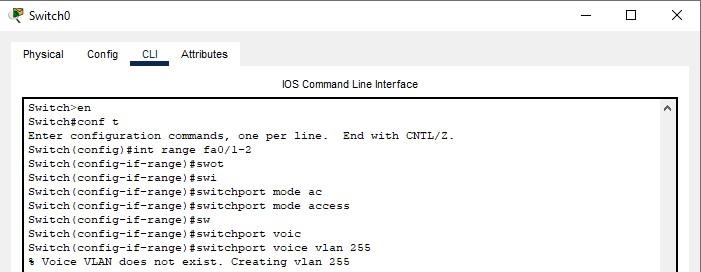

University: [ITMO University](https://itmo.ru/ru/)
Faculty: [FICT](https://fict.itmo.ru)
Course: [IP-telephony](https://itmo-ict-faculty.github.io/ip-telephony/)
Year: 2022/2023
Group: K34212
Author: Leshkov Roman Sergeevich
Lab: Lab1
Date of create: 07.03.2023
Date of finished: 07.03.2023

Цель работы: 

Изучить рабочую среду Cisco Packet Tracer, ознакомить- ся с интерфейсами основных устройств, типами кабелей, научиться собирать топологию. Изучить построение сети IP-телефонии с помощью маршрутизатора, коммутатора и IP телефонов Cisco 7960 в среде Packet tracer

Ход работы:

Часть 1

Собрана схема соединения из четырех свичей и семи хостов.

Хостам назначены ip-адреса, начиная с 192.168.0.1 до 192.168.0.7 с масками 255.255.255.0.

После назначения ip-адресов хосты смогли пинговать друг друга.

Часть 2

Собрана схема соединения из одного роутера, свича и двух ip-телефонов.

Роутеру назначено имя CMERouter командой.
    
    hostname CMERouter
    

Поднят интерфейс fa0/0 для vlan 1 и саб-интерфейс fa0/0.255 для vlan 255. Им заданы ip 192.168.0.1/24 и 192.168.255.1/24 соответсвенно.

      int fa0/0
      ip add 192.168.0.1 255.255.255.0
      no shutdown
      int fa0/0.255
      enc dot1Q 255
      ip add 192.168.255.1 255.255.255.0

Для назначения ip-адресов для телефонов поднят DHCP пул с именем ip-telephony для сети 192.168.255.0/24 с шлюзом 192.168.255.1. Для ip-телефонии нужно указать адрес сервера, которым является сам маршрутизатор, поэтому указывается адрес 192.168.255.1. Option 150 - стандарт для передачи данных для устройств Cisco.

      ip dhcp pool ip-yelephony
      net 192.168.255.0 255.255.255.0
      default 192.168.255.1
      option 150 ip 192.168.255.1
  

Для настройки телефонии также нужно указать максимальное количество устройств и номеров. Для автоматического присвоения ip для телефонов 1 и 2 включен параметр auto assign 1 to 2. Также указывается адрес обработчика звонков, которым является сам ройтер.

      telephony-service
      max-dn 2
      max-ephones 2 
      auto assign 1 to 2
      ip source 192.168.255.1 port 3100
  

На свиче настроены интерфесы ведущие к телефонам: указываются режим access и vlan для передачи голоса.

      int range fa0/1-2
      switchport mode access
      switchport voice vlan 255
  

На свиче в сторону на интерфейсе, ведущему к роутеру, ставится режим trunk с vlan 1 и 255.

      int gi0/1
      switchport mode trunk
      switchport trunk allowed vlan add 255

Далее необходимо включить питание на телефонах, так как по умолчанию телефоны обесточены.

На роутере создаются телефонные номера, за которми после создания закрепляются выданные ip-адреса.

После набора номера и поднятия трубки телефона, звонок доходит до телефона с введенным номером.

Вывод:

Собраны и настроены две схемы. Во второй части на роуторе поднят DHCP пул, и настроены услуги ip-телефонии, включая максимальное количество устройств и номеров, автоматическое закрепление ip-адресов за телефонами 1 и 2. На свиче указан vlan 255 для голосовых сообщений.
