University: [ITMO University](https://itmo.ru/ru/)
Faculty: [FICT](https://fict.itmo.ru)
Course: [IP-telephony](https://itmo-ict-faculty.github.io/ip-telephony/)
Year: 2022/2023
Group: K34212
Author: Leshkov Roman Sergeevich
Lab: Lab2
Date of create: 17.03.2023
Date of finished: 17.03.2023

Цель работы: 

Изучить построение сети IP-телефонии с помощью маршрутизатора Cisco 2811, коммутатора Cisco catalyst 3560 и IP телефонов Cisco 7960.

Ход работы:

Часть 1

Собрана схема соединения из одного роутера, свича L3 и трех ip-телефонов. Роутер и свич соединены кроссовым проводом.

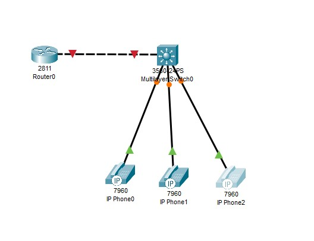

Роутеру назначено имя CMERouter командой.

    hostname CMERouter

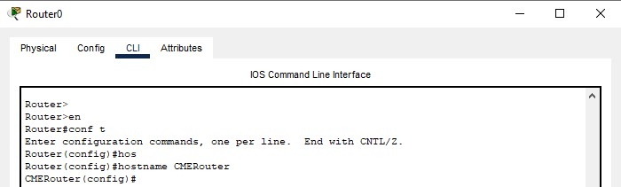

Отключен синтаксис ввода слов от DNS серверов, что поможет избежать блокировки ввода при вводе неправильной команды.

    no ip domain-lookup

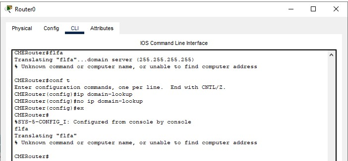

Создан логин и пароль для защиты роутера в удаленном режиме и в режиме консоли.

    service password-encryption
    username rlesh priv 15 secret 111
    
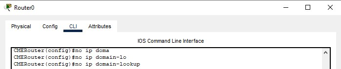
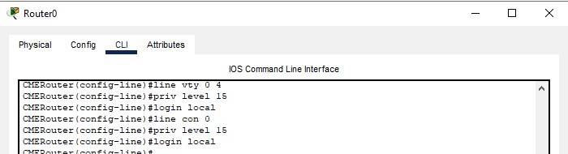

Поднят интерфейс fa0/0 для vlan 1 и саб-интерфейс fa0/0.255 для vlan 255. Им заданы ip 192.168.0.1/24 и 192.168.255.1/24 соответсвенно.

      int fa0/0
      ip add 192.168.0.1 255.255.255.0
      no shutdown
      int fa0/0.255
      enc dot1Q 255
      ip add 192.168.255.1 255.255.255.0

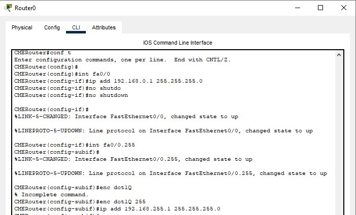

Для назначения ip-адресов для телефонов поднят DHCP пул с именем ip-telephony для сети 192.168.255.0/24 с шлюзом 192.168.255.1. Для ip-телефонии нужно указать адрес сервера, которым является сам маршрутизатор, поэтому указывается адрес 192.168.255.1. Option 150 - стандарт для передачи данных для устройств Cisco.

      ip dhcp pool ip-telephony
      net 192.168.255.0 255.255.255.0
      default 192.168.255.1
      option 150 ip 192.168.255.1

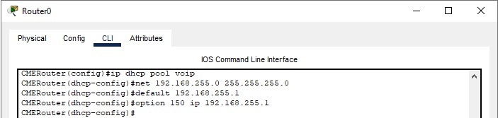

Для настройки телефонии также указаны максимальное количество устройств и номеров. Для автоматического присвоения ip для телефонов 1 и 3 включен параметр auto assign 1 to 3. Также указывается адрес обработчика звонков, которым является сам роутер.

      telephony-service
      max-dn 3
      max-ephones 3 
      auto assign 1 to 3
      ip source 192.168.255.1 port 3100

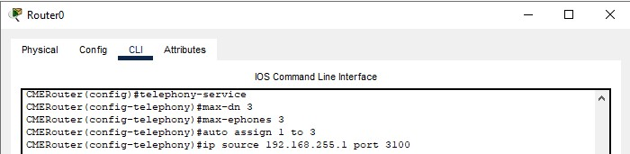

На свиче настроены интерфесы ведущие к телефонам: указываются режим access и vlan для передачи голоса.

      int range fa0/1-3
      switchport mode access
      switchport voice vlan 255

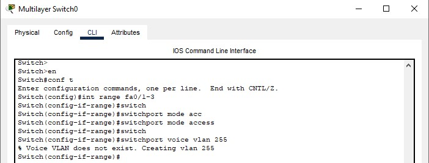

На свиче в сторону на интерфейсе, ведущему к роутеру, ставится режим trunk с vlan 1 и 255.

      int gi0/1
      switchport trunk encapsulation dot1q
      switchport mode trunk
      switchport trunk allowed vlan add 255

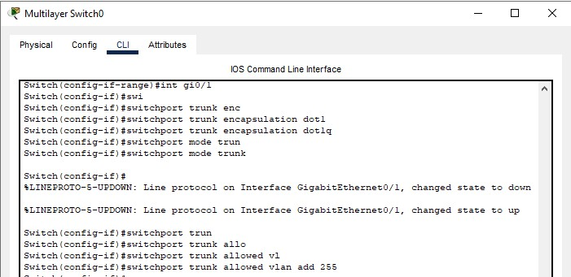

На роутере создаются телефонные номера, за которми после создания закрепляются выданные ip-адреса.

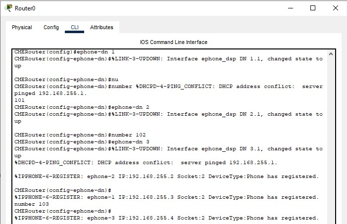

После набора номера и поднятия трубки телефона, звонок доходит до телефона с введенным номером.

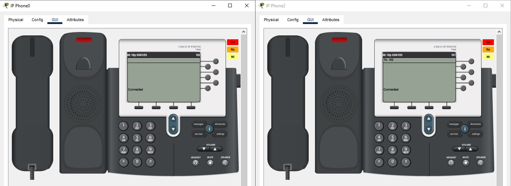

Часть 2

Повторяется часть 1, затем задается маршрут по умолчанию командой ip default-gateway на свиче L3.

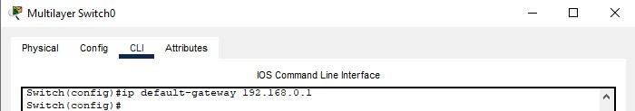

Подключаются конечные узлы устройств.

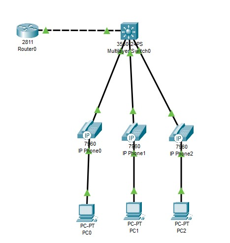

Для ПК задаюся ip-адреса.

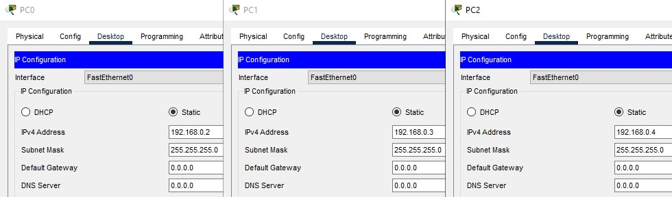

На этом настройка сети закончена. Телефоны работают, ПК может пинговать другие ПК и маршрутизатор.

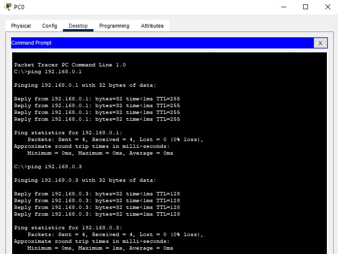

Вывод:

Настроена тополгия из одного роутера, свича L3 и трех ip-телефонов, и трех ПК подключенных через ip-телефоны. Для VoIP указан vlan 255 и настроен DHCP. На свиче укзан шлюз по умолчанию указывающий на роутер.
