University: [ITMO University](https://itmo.ru/ru/)
Faculty: [FICT](https://fict.itmo.ru)
Course: [IP-telephony](https://itmo-ict-faculty.github.io/ip-telephony/)
Year: 2022/2023
Group: K34212
Author: Leshkov Roman Sergeevich
Lab: Lab4
Date of create: 21.03.2023
Date of finished: 24.03.2023

Цель работы: 

Изучить построение сети IP-телефонии между удаленными филиалами с помощью маршрутизаторов Cisco 2811 и коммутаторов Cisco 2950Т.

Филиалы будут соединены через serial порты, для этого в роутеры cisco 2811 поставлены модули WIC-2T.

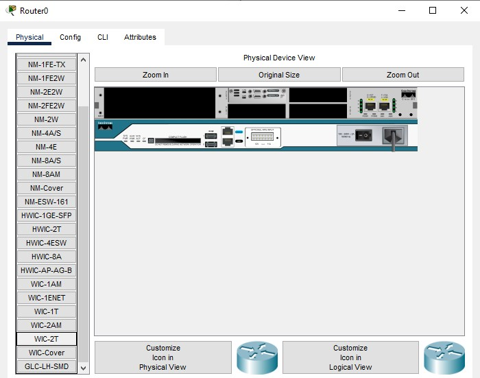

Собирается топология: два одинаковых филиала со своей ip-телефонией, свитчом и роутером. Филиалы соединены через serial порт.

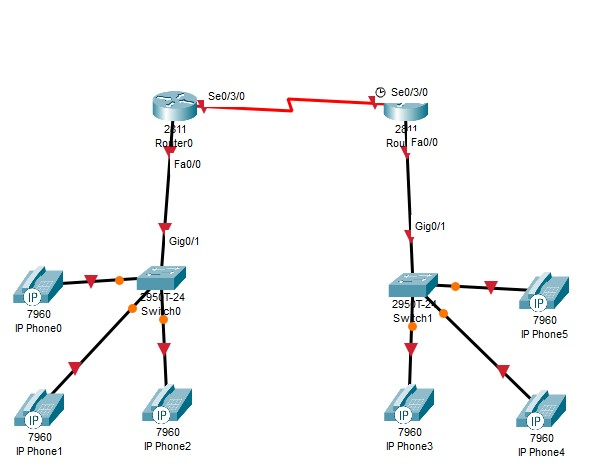

На роутерах настраиваются порты fa0/0: на Router0 сеть 192.168.0.1/24 для данных и 192.168.255.1/24 для voip, на Router1 сеть 192.168.1.1/24 для данных и 192.168.254.1/24 для voip.

Router0:

    int fa0/0
    ip add 192.168.0.1 255.255.255.0
    no shutdown
    int fa0/0.255
    enc dot1Q 255
    ip add 192.168.255.1 255.255.255.0
    
Router1:

    int fa0/0
    ip add 192.168.1.1 255.255.255.0
    no shutdown
    int fa0/0.254
    enc dot1Q 254
    ip add 192.168.254.1 255.255.255.0

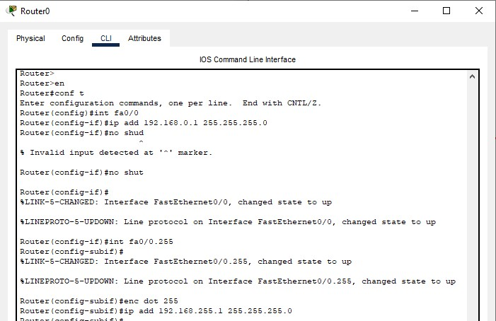

Также на роутерах поднимается DHCP сервер для voip: у Router0 сеть 192.168.255.0/24, у Router1 сеть 192.168.254.0/24.

Router0:

    ip dhcp pool voip
    net 192.168.255.0 255.255.255.0
    default 192.168.255.1
    option 150 ip 192.168.255.1
    
Router1:

    ip dhcp pool voip
    net 192.168.254.0 255.255.255.0
    default 192.168.254.1
    option 150 ip 192.168.254.1

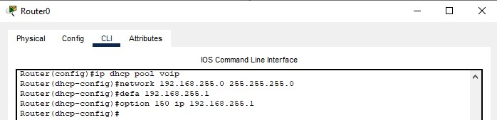

Далее вкличается сервис ip-телефонии: указывается количество телефонов, номеров, автоприсваивание номеров, сервер обработки звонков.

Router0:

    telephony-service
    max-dn 3
    max-ephones 3 
    auto assign 1 to 3
    ip source 192.168.255.1 port 3100

Router1:

    telephony-service
    max-dn 3
    max-ephones 3 
    auto assign 1 to 3
    ip source 192.168.254.1 port 3100
    
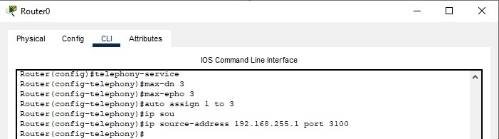

Указываются номера телефонов: для левого филиала номера: 101, 102, 103, для правого: 201, 202, 203.

Router0:

    ephone-dn 1
    number 101
    ephone-dn 2
    number 102
    ephone-dn 3
    number 103

Router1:

    ephone-dn 1
    number 201
    ephone-dn 2
    number 202
    ephone-dn 3
    number 203

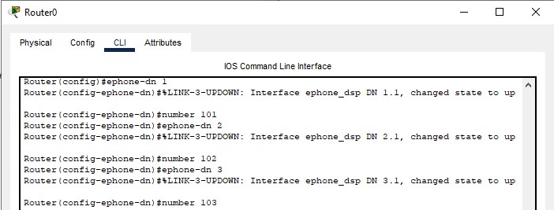

На свичах указываются порты для конечных устройств, настраивается влан для голоса. А на порт смотрящий на роутер ставится mode trunk.

Switch0:

    int range fa0/1-3
    switchport mode access
    switchport voice vlan 255
    int gi0/1
    switchport mode trunk
    switchport trunk allowed vlan 1,255
    
Switch1:

    int range fa0/1-3
    switchport mode access
    switchport voice vlan 254
    int gi0/1
    switchport mode trunk
    switchport trunk allowed vlan 1,254

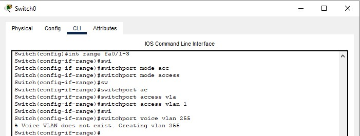
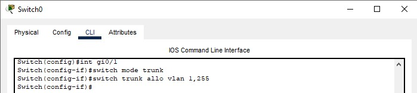

После включения телефонов на роутерах регистрируются телефоны, и им присваиваются номера.

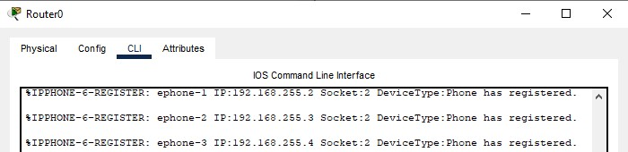

После настроек телефония работает в каждом филиале, но межфилиальные звонки еще недоступны.

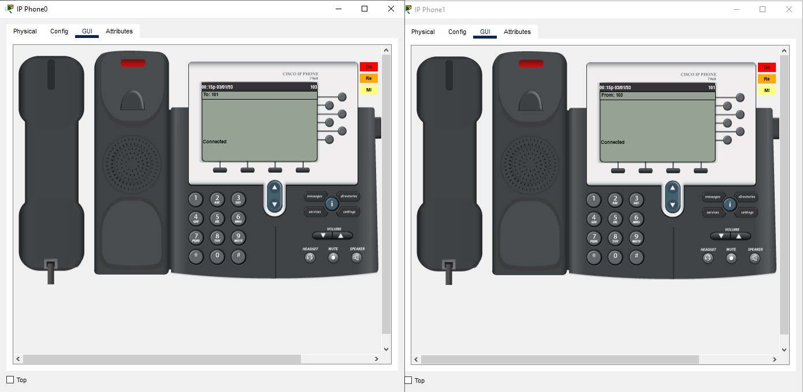
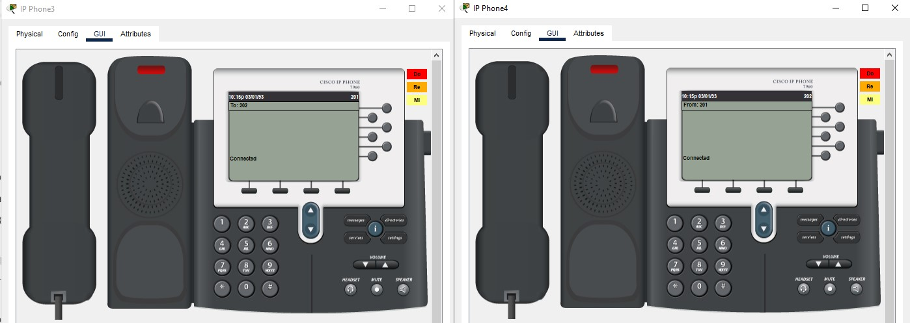

Для маршрутизации между филиалами настраивается протокол RIP на роутерах: поднимается порты s0/3/0, указываются версия RIPv2 и сети, на границе которых находится роутер. 

Router0:

    int s0/3/0
    ip add 10.0.0.1 255.255.255.252
    no shutdown
    router rip
    ver 2
    net 192.168.255.0
    net 10.0.0.0
    
Router1:

    int s0/3/0
    ip add 10.0.0.2 255.255.255.252
    no shutdown
    router rip
    ver 2
    net 192.168.254.0
    net 10.0.0.0

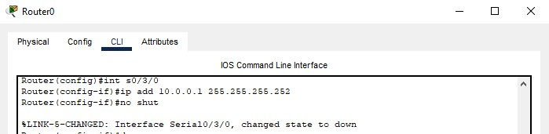
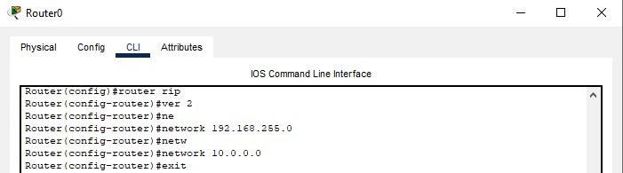
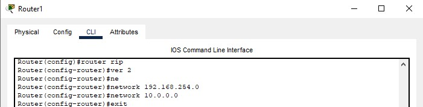

Для переадрисации номеров создается правило, следуя которому номера подходящие под шаблон будут переадрисовываться в другой филиал: трехзначные номера, начинающиеся на 1 будут идти на 10.0.0.1, а на 2 - на 10.0.0.2 

Router0:

    dial-peer voice 1 voip
    dest 2..
    session target ipv4:10.0.0.2
    
Router1:

    dial-peer voice 1 voip
    dest 1..
    session target ipv4:10.0.0.1

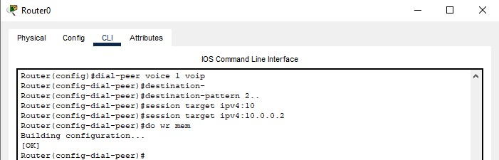
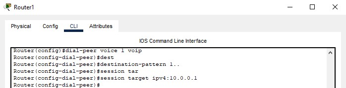

Теперь связь между филиалами настроена.

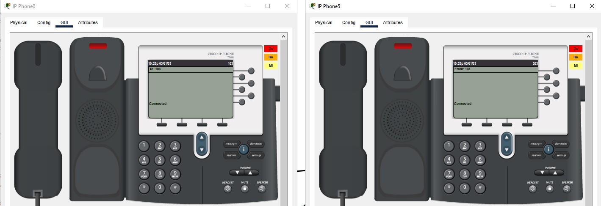

Вывод:

Настроена IP-телефония в двух филиалах, настроен протокол rip для сетей телефонии. Настроена переадрисация номеров по шаблону в другой филиал.
